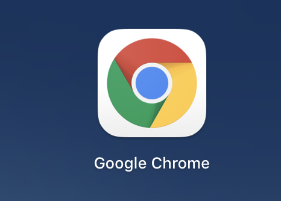

# 新手上路
    
## 这里有markdomn语法的书写示例
* 无序列表
* 无序列表
* 无序列表

## 用##的标题会成为子目录

## 这个标题不会在子目录中 <!-- {docsify-ignore} -->


> 引用文字

?> 突出一块说明

    文本段落

```js
console.log('js 代码块')
```
---
<br>
**加粗**

[链接文字](https://baidu.com)

